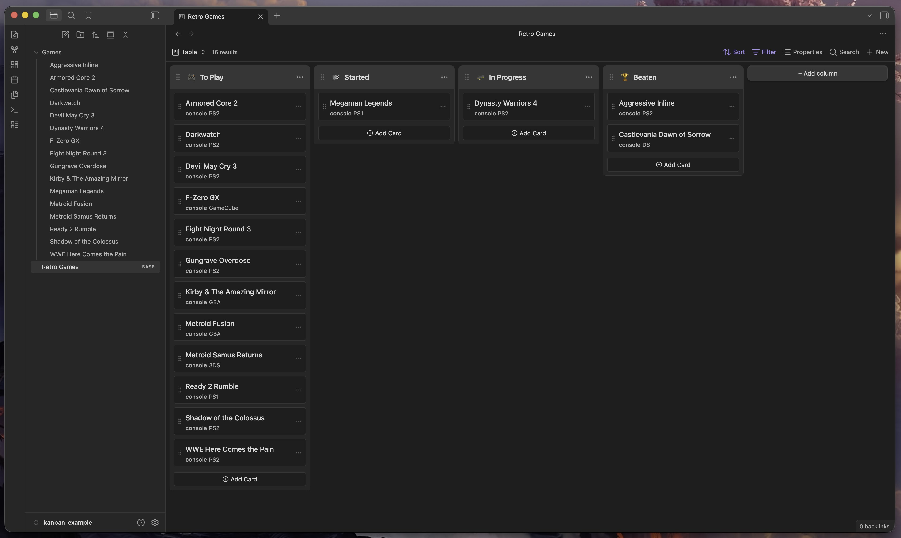
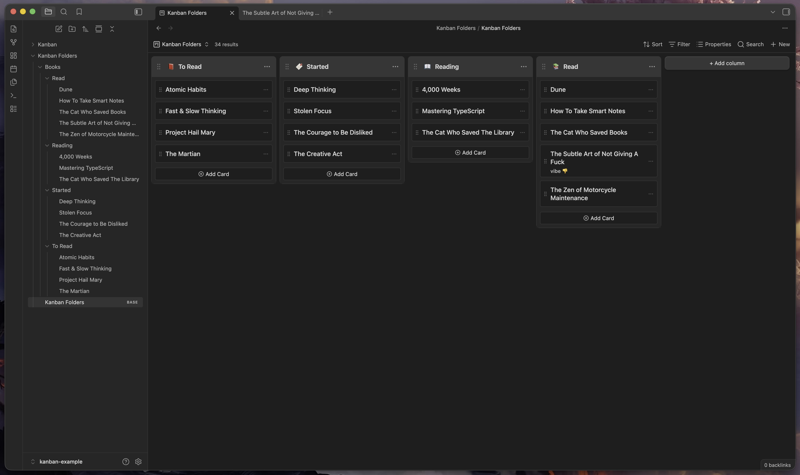

# Kanban Base

A plugin for [Obsidian](https://obsidian.md) that adds two kanban views to
[Bases](https://obsidian.md/bases).

Requires Obsidian 1.10.1+.

## Views

### Kanban (Property)

Groups notes into columns by a text property value (e.g. a `status` field). Set
the group-by field in the base to any text property and each unique value
becomes a column. Changing a card's column updates that property on the note.

### Kanban Folders

Groups notes into columns by their immediate parent folder. Each direct
subfolder of the base's root folder is a column. Moving a card between columns
physically moves the file to that folder — Obsidian handles link updates
automatically.

## How to install

### Using BRAT

1. Install [BRAT](https://github.com/TfTHacker/obsidian42-brat) from the
   community plugins directory.
2. Open BRAT settings and click **Add Beta Plugin**.
3. Enter `https://github.com/jaidetree/obsidian-kanban-base`.

### Using Community Plugins

Search for **Kanban Base** in Settings → Community plugins → Browse.

### Manual install

1. Download `main.js`, `manifest.json`, and `styles.css` from the
   [latest release](https://github.com/jaidetree/obsidian-kanban-base/releases/latest).
2. Copy them to `.obsidian/plugins/kanban-base/` in your vault.
3. Enable the plugin in Settings → Community plugins.

## Usage

1. Open or create a base file.
2. Click the view selector and choose **Kanban** or **Kanban Folders**.

### Kanban (Property)

- Set the base's group-by field to a text property (e.g. `status`).
- Cards are grouped by property value. Drag cards between columns to update the
  property.

### Kanban Folders

- Set the base folder to a directory that contains subfolders.
- Each subfolder becomes a column. Drag cards between columns to move the file.

## Feedback and feature requests

[Open an issue](https://github.com/jaidetree/obsidian-kanban-base/issues).

## Contributing

Open an issue before submitting a PR — I don't want to merge work that doesn't
fit the direction of the project.

## AI Disclaimer

Development was largely done with Claude. I'm a professional frontend engineer
and have reviewed and tested this project during every phase of development.

## License

MIT
